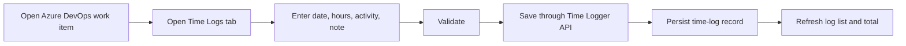

# Azure DevOps Time Logger

A lightweight Azure DevOps extension for logging time against work items at a daily, granular level.

The product is intended to give teams a Jira/Ruddr-style work-log experience inside Azure DevOps while keeping Azure DevOps work items as the source of delivery context and the Time Logger service as the source of detailed time-entry history.

> Status: MVP implemented; Azure DevOps test-organization deployment remains
> Last updated: 2026-09-23

## Why this exists

Azure DevOps work items can hold aggregate values such as Original Estimate, Remaining Work, Completed Work, or custom "Actual Hours" fields, but those fields do not provide a convenient daily log of who spent time, when they spent it, what activity it was for, and what they worked on.

This project adds that missing layer.

Example:

| Date       | User        | Hours | Activity    | Note                                    |
| ---------- | ----------- | ----: | ----------- | --------------------------------------- |
| 2026-09-21 | Developer A |   2.0 | Development | Implemented booking API validation      |
| 2026-09-22 | Developer A |   1.5 | Code Review | Reviewed booking API PR                 |
| 2026-09-23 | QA A        |   2.0 | Testing     | Regression tested duplicate booking fix |

The work item can still show a summarized total, while the Time Logger retains the detailed history.

## Product shape

The primary user experience is a **Time Logs** tab on the Azure DevOps work item form.

Users can:

- log time against the currently opened work item;
- view existing time logs;
- see total logged hours;
- edit or delete their own entries, subject to permissions;
- capture a date, hours, activity, and note.

Future phases add weekly timesheets, reporting, optional synchronization to Azure DevOps aggregate fields, data-lake ingestion, Power BI reporting, Ruddr integration, and ML/AI-assisted delivery insights.

## Technology

### Extension

- React
- TypeScript
- Azure DevOps Extension SDK
- Azure DevOps Extension API
- Azure DevOps work-item-form page contribution

### Backend

- Node.js
- TypeScript
- Fastify REST API
- Prisma ORM
- PostgreSQL
- REST endpoints for time-log operations

Using TypeScript on both the extension and API allows shared request/response contracts and validation types where appropriate.

### Analytics, later phase

- Azure DevOps Analytics/OData for delivery metadata
- Service Hooks for selected near-real-time events where needed
- Scheduled export/ingestion of time logs
- Data lake / lakehouse
- Power BI
- Optional ML/AI layer

## Repository structure

```text
/
├── README.md
├── docs/                 # Product, requirements, architecture, decisions, roadmap
├── packages/contracts/   # Shared API-facing TypeScript contracts
├── src/
│   ├── extension/        # React Azure DevOps work-item page
│   └── api/              # Fastify API and Prisma migrations
├── docker-compose.yml    # Local PostgreSQL
└── .github/workflows/    # Build and test CI
```

## Core data model

A time log is a first-class record, not just a number copied into a work-item field.

```json
{
  "id": "uuid",
  "organizationId": "org-id",
  "projectId": "project-id",
  "workItemId": 160637,
  "userId": "user-id",
  "userDisplayName": "Developer A",
  "workDate": "2026-09-23",
  "hours": 2.5,
  "activity": "Development",
  "note": "Implemented API validation",
  "createdAt": "2026-09-23T09:10:00Z",
  "updatedAt": "2026-09-23T09:10:00Z"
}
```

## MVP user flow



## Important product rule

Do **not** treat an Azure DevOps aggregate field as the detailed time-log database.

For example:

```text
Original Estimate = 15h
Remaining Work    = 8.5h
Actual/Completed  = 6.5h
```

is useful summary information, but it does not explain the daily work behind the `6.5h`.

The detailed entries in the Time Logger remain the audit/history source.

## Local development

Prerequisites: Node.js 20 or newer and Docker.

```bash
npm install
npm run prisma:generate -w @time-logger/api

docker compose up -d postgres
cp src/api/.env.example src/api/.env
npm run prisma:migrate -w @time-logger/api

# Terminal 1: Fastify API on http://localhost:3000
npm run dev:api

# Terminal 2: extension UI with a clearly labelled mock context
npm run dev:extension
```

The local extension defaults to work item `160637`. Override the mock context with query parameters such as:

```text
http://localhost:5173/?organizationId=local-org&projectId=local-project&workItemId=42&workItemType=Task
```

`development-headers` authentication is accepted only when `NODE_ENV` is `development` or `test`. Production startup rejects that mode.

## Verify the repository

```bash
npm run typecheck
npm test
npm run build
npm run package:extension -w @time-logger/extension
```

The VSIX is written under `src/extension/` and ignored by Git.

## Azure DevOps pilot setup

1. Deploy the API and PostgreSQL, set `DATABASE_URL`, and run `npm run prisma:migrate -w @time-logger/api`.
2. Publish the extension once, obtain its certificate key from the Azure DevOps extension management portal, and store it in the API secret store as `EXTENSION_SECRET`.
3. Set `AUTH_MODE=app-token`, `NODE_ENV=production`, and `CORS_ALLOWED_ORIGINS` to the exact extension content origin.
4. Replace `replace-with-your-publisher-id` in `src/extension/vss-extension.json`.
5. Build with the deployed API URL, for example `VITE_API_BASE_URL=https://time.example.com npm run package:extension -w @time-logger/extension`.
6. Upload the VSIX privately and install it in the test organization.

The manifest requests no Azure DevOps REST scopes. Work-item, project, organization, and user context come from the host SDK; API requests use `SDK.getAppToken()`. The API validates that signed token and derives ownership from its stable user claim. Never place the extension certificate key in the frontend or manifest.

## API

Authenticated endpoints are scoped by organization and project as well as work-item ID:

```text
POST   /api/time-logs
GET    /api/time-logs?organizationId=...&projectId=...&workItemId=...
GET    /api/time-logs/:id?organizationId=...&projectId=...
PUT    /api/time-logs/:id
DELETE /api/time-logs/:id?organizationId=...&projectId=...&version=...
GET    /api/time-logs/summary?organizationId=...&projectId=...&workItemId=...
GET    /health
```

OpenAPI UI is available at `/docs` outside production. Create accepts an `Idempotency-Key`; update/delete require the current version and return `409` for stale writes. Delete is a soft delete.

## Documentation map

- [PRODUCT.md](./docs/PRODUCT.md) — product purpose, users, value, scope.
- [REQUIREMENTS.md](./docs/REQUIREMENTS.md) — functional and non-functional requirements.
- [ARCHITECTURE.md](./docs/ARCHITECTURE.md) — system structure and data flows.
- [DECISIONS.md](./docs/DECISIONS.md) — important technical/product decisions.
- [ROADMAP.md](./docs/ROADMAP.md) — staged delivery plan.
- [AGENTS.md](./docs/AGENTS.md) — instructions for Codex and other coding agents.

## Definition of MVP success

The MVP is successful when a user can open a supported Azure DevOps work item, create a valid time entry, refresh/reopen the work item, and see the persisted entry and correct total without manually entering the work item ID.

## Reference material

The implementation follows Microsoft's current guidance for [work-item form page contributions](https://learn.microsoft.com/en-us/azure/devops/extend/develop/add-workitem-extension?view=azure-devops) and [authenticating requests to an extension-owned service](https://learn.microsoft.com/en-us/azure/devops/extend/develop/auth?view=azure-devops).
