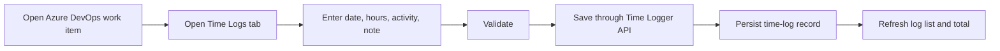

# Azure DevOps Time Logger

A lightweight Azure DevOps extension for logging time against work items at a daily, granular level.

The product is intended to give teams a Jira/Ruddr-style work-log experience inside Azure DevOps while keeping Azure DevOps work items as the source of delivery context and the Time Logger service as the source of detailed time-entry history.

> Status: Draft product and engineering specification  
> Last updated: 2026-09-23

## Why this exists

Azure DevOps work items can hold aggregate values such as Original Estimate, Remaining Work, Completed Work, or custom "Actual Hours" fields, but those fields do not provide a convenient daily log of who spent time, when they spent it, what activity it was for, and what they worked on.

This project adds that missing layer.

Example:

| Date | User | Hours | Activity | Note |
|---|---|---:|---|---|
| 2026-09-21 | Developer A | 2.0 | Development | Implemented booking API validation |
| 2026-09-22 | Developer A | 1.5 | Code Review | Reviewed booking API PR |
| 2026-09-23 | QA A | 2.0 | Testing | Regression tested duplicate booking fix |

The work item can still show a summarized total, while the Time Logger retains the detailed history.

## Product shape

The primary user experience is a **Time Logs** tab on the Azure DevOps work item form.

Users can:

- log time against the currently opened work item;
- view existing time logs;
- see total logged hours;
- edit or delete their own entries, subject to permissions;
- capture a date, hours, activity, and note.

Future phases add weekly timesheets, reporting, optional synchronization to Azure DevOps aggregate fields, data-lake ingestion, Power BI reporting, Ruddr integration, and ML/AI-assisted delivery insights.

## Proposed technology

### Extension

- React
- TypeScript
- Azure DevOps Extension SDK
- Azure DevOps Extension API
- Azure DevOps work-item-form page contribution

### Backend

- ASP.NET Core 8 Web API
- Entity Framework Core
- PostgreSQL
- REST endpoints for time-log operations

### Analytics, later phase

- Azure DevOps Analytics/OData for delivery metadata
- Service Hooks for selected near-real-time events where needed
- Scheduled export/ingestion of time logs
- Data lake / lakehouse
- Power BI
- Optional ML/AI layer

## Expected repository structure

```text
/
├── README.md
├── PRODUCT.md
├── REQUIREMENTS.md
├── ARCHITECTURE.md
├── DECISIONS.md
├── ROADMAP.md
├── AGENTS.md
├── src/
│   ├── extension/
│   └── api/
├── tests/
│   ├── extension/
│   └── api/
└── infra/
```

The actual repository structure may differ once implementation starts. `AGENTS.md` requires Codex to inspect the repository before creating or moving files.

## Core data model

A time log is a first-class record, not just a number copied into a work-item field.

```json
{
  "id": "uuid",
  "organizationId": "org-id",
  "projectId": "project-id",
  "workItemId": 160637,
  "userId": "user-id",
  "userDisplayName": "Developer A",
  "workDate": "2026-09-23",
  "hours": 2.5,
  "activity": "Development",
  "note": "Implemented API validation",
  "createdAt": "2026-09-23T09:10:00Z",
  "updatedAt": "2026-09-23T09:10:00Z"
}
```

## MVP user flow



## Important product rule

Do **not** treat an Azure DevOps aggregate field as the detailed time-log database.

For example:

```text
Original Estimate = 15h
Remaining Work    = 8.5h
Actual/Completed  = 6.5h
```

is useful summary information, but it does not explain the daily work behind the `6.5h`.

The detailed entries in the Time Logger remain the audit/history source.

## Local development

The exact commands depend on the scaffold selected during implementation. A likely flow is:

```bash
# Extension
cd src/extension
npm install
npm run dev

# API
cd ../api
dotnet restore
dotnet run
```

Do not add placeholder commands to CI until they actually work in the repository.

## Documentation map

- [PRODUCT.md](./PRODUCT.md) — product purpose, users, value, scope.
- [REQUIREMENTS.md](./REQUIREMENTS.md) — functional and non-functional requirements.
- [ARCHITECTURE.md](./ARCHITECTURE.md) — system structure and data flows.
- [DECISIONS.md](./DECISIONS.md) — important technical/product decisions.
- [ROADMAP.md](./ROADMAP.md) — staged delivery plan.
- [AGENTS.md](./AGENTS.md) — instructions for Codex and other coding agents.

## Definition of MVP success

The MVP is successful when a user can open a supported Azure DevOps work item, create a valid time entry, refresh/reopen the work item, and see the persisted entry and correct total without manually entering the work item ID.

## Reference material

Implementation should be checked against the current Microsoft Azure DevOps extension documentation before coding contribution points, manifest scopes, or authentication flows.
