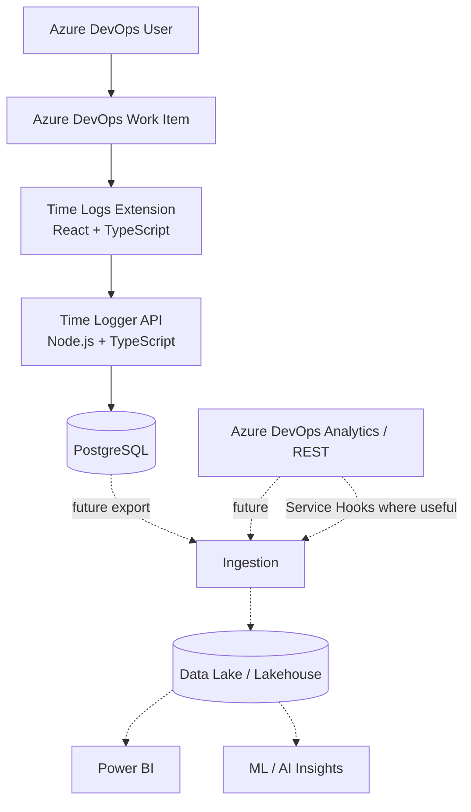
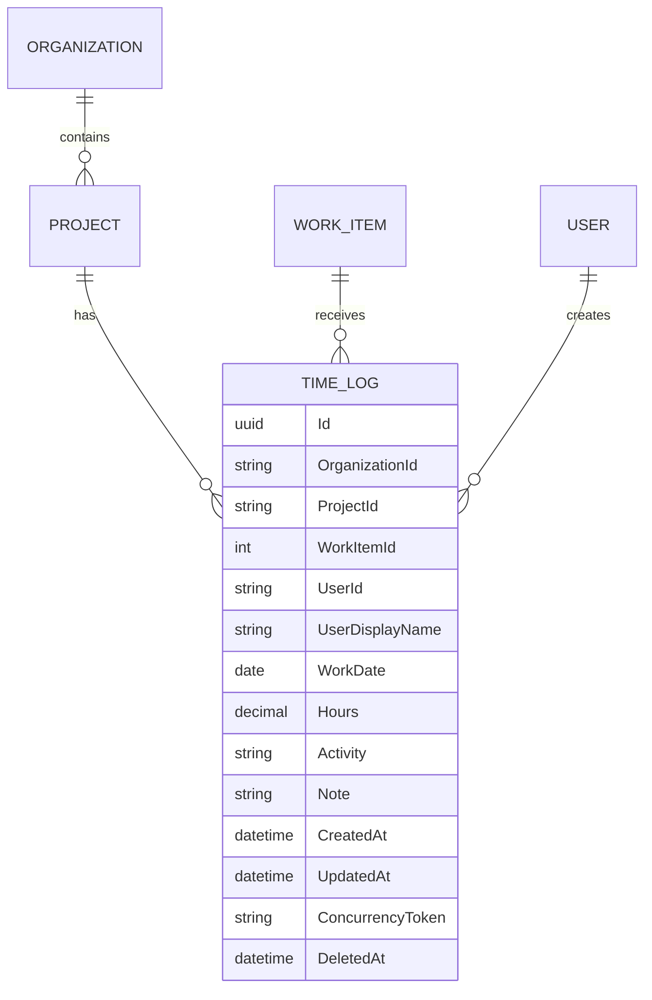
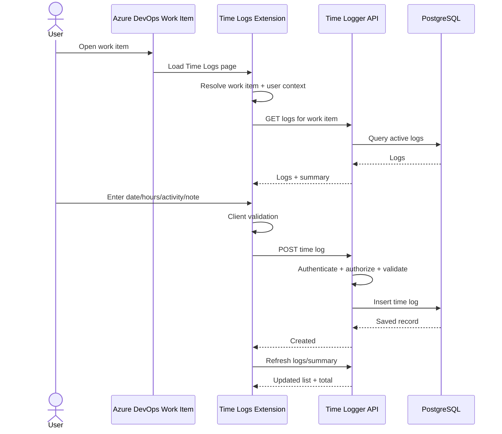
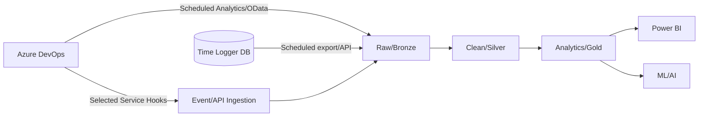

# Architecture

## Overview

The system is split into three logical areas:

1. **Azure DevOps Extension** — user interface inside the work-item form.
2. **Time Logger API + Database** — authoritative time-log persistence and business rules.
3. **Analytics Integration** — future data-lake/reporting layer, deliberately outside the MVP critical path.



## Azure DevOps extension

### Contribution

The preferred MVP contribution is a work-item-form **page/tab** named `Time Logs`.

Why a page instead of a small group:

- log history can grow;
- edit/delete controls need space;
- a future work-item summary can be added without crowding the Details form;
- the feature remains easy to discover.

Current Azure DevOps extension documentation should be checked before implementation. At the time of this specification, the relevant contribution type is the work-item-form page contribution and the implementation uses the modern Azure DevOps Extension SDK.

### Extension responsibilities

The extension is responsible for:

- initializing the Azure DevOps SDK;
- obtaining current organization/project/work-item context;
- obtaining current user context;
- rendering the Time Logs UI;
- client-side validation for fast feedback;
- invoking the Time Logger API;
- displaying loading, success, validation, and error states.

The extension is **not** responsible for:

- authorization decisions;
- being the permanent time-log data store;
- storing secrets;
- calculating organization-wide analytics.

## Backend

### Technology

Proposed MVP backend:

- Node.js;
- TypeScript;
- Fastify REST API;
- Prisma ORM;
- PostgreSQL;
- OpenAPI in non-production or controlled environments;
- structured logging.

The extension and API are both TypeScript projects. Shared DTO/schema types may live in a small shared package, but domain logic must not be coupled to browser-specific Azure DevOps APIs.

### Responsibilities

The backend owns:

- authentication validation;
- authorization;
- time-log validation;
- create/read/update/delete rules;
- ownership rules;
- concurrency;
- persistence;
- summary calculations;
- analytics/export contracts added later.

### Shared TypeScript contracts

Where useful, transport contracts can be shared between the extension and API:

```text
packages/
└── contracts/
    ├── time-log.ts
    ├── activity.ts
    └── api-errors.ts
```

Only stable API-facing types belong in the shared package. Database models and Azure DevOps SDK objects should not be exported as shared contracts.

## Authentication and authorization

The MVP authenticates through the Azure DevOps Extension SDK. The extension requests the minimal `vso.profile` scope and sends the current user's Azure DevOps access token to the API. The API presents that token to the Azure DevOps `profiles/me` endpoint and derives ownership from the returned profile UUID. `SDK.getUser()` remains useful for display context, but the browser never supplies an authoritative `userId`.

This flow must be exercised in the target test organization because access-token issuance is host-managed. A separate header-based identity mode exists only for local development and tests; API startup rejects that mode in production. Legacy app-token and Entra validation remain available as transition modes but are not used for production.

Rules:

- do not invent a custom password system;
- do not trust a `userId` supplied by the browser;
- do not embed PATs, client secrets, or API keys in extension JavaScript;
- map authenticated identity to a stable internal user identifier;
- enforce edit/delete ownership on the server.

The manifest requests only `vso.profile`, which is required to resolve the authenticated user's own Azure DevOps profile.

## Core domain model



The MVP may avoid separate Organization, Project, WorkItem, and User tables if those entities are only referenced by stable IDs. Introduce normalized tables only when they provide a concrete benefit.

## Suggested database table

```sql
TimeLogs
--------
Id                 uuid / uniqueidentifier
OrganizationId     varchar
ProjectId          varchar
WorkItemId         integer
UserId             varchar
UserDisplayName    varchar
WorkDate           date
Hours              decimal(5,2)
Activity           varchar
Note               text
CreatedAt          timestamptz
UpdatedAt          timestamptz
DeletedAt          timestamptz nullable
Version            concurrency token
```

Recommended indexes:

```text
(OrganizationId, ProjectId, WorkItemId, WorkDate)
(UserId, WorkDate)
(OrganizationId, ProjectId, WorkDate)
```

## Create-time-log flow



## Work-item metadata

The time log stores the stable work-item ID and project context.

The backend does not need to duplicate the full Azure DevOps work-item document for the MVP.

When reporting requires work-item metadata such as:

- title;
- type;
- state;
- sprint;
- area;
- parent hierarchy;
- estimate fields;

that information can be acquired through Azure DevOps APIs/Analytics during the analytics phase.

## Aggregate work fields

Time Logger records are the detailed source of logged time.

Future optional synchronization may update fields such as:

```text
Completed Work
Actual Hours (custom)
Remaining Work
```

That synchronization must be configurable because different teams use Azure DevOps work fields differently.

Do not make aggregate-field synchronization a hidden side effect of creating a time log.

## Analytics and data-lake architecture

The analytics layer is a future phase.



### Scheduled OData

Use for repeatable extraction of Azure DevOps delivery/reporting data where near-real-time behavior is not required.

Examples:

- work items;
- work-item revisions/history;
- iterations;
- hierarchy;
- selected delivery fields.

### Service Hooks

Use selectively when an event must be reacted to soon after it happens.

Do not use Service Hooks simply because they exist; scheduled ingestion is easier to operate for many reporting use cases.

### Time Logger ingestion

The Time Logger owns granular time entries, so those records should be exported from the product API/database through a controlled ingestion path.

## API boundary

Initial API shape:

```text
POST   /api/time-logs
GET    /api/time-logs?workItemId={id}
GET    /api/time-logs/{id}
PUT    /api/time-logs/{id}
DELETE /api/time-logs/{id}
GET    /api/time-logs/summary?workItemId={id}
```

All work-item queries must be scoped by organization/project context as well as work-item ID.

## Error model

API errors should have a stable machine-readable shape.

Example:

```json
{
  "code": "TIME_LOG_VALIDATION_FAILED",
  "message": "The time log is invalid.",
  "errors": {
    "hours": ["Hours must be greater than zero."]
  },
  "correlationId": "..."
}
```

Do not expose stack traces to extension users.

## Configuration

Configuration should be environment based.

Examples:

```text
API base URL
database connection
allowed origins
authentication settings
telemetry settings
activity configuration
supported work-item types
```

Secrets must be stored in a secret manager or deployment secret store, not source control.

## Testing strategy

### Extension

- component tests;
- validation tests;
- API client tests;
- work-item-context adapter tests;
- limited end-to-end tests against a test Azure DevOps organization.

### API

- unit tests for validation and ownership;
- integration tests with database;
- API contract tests;
- authorization tests;
- concurrency tests.

### Manual acceptance

Use the Vita-Rapidus test Azure DevOps project for end-to-end validation before wider installation.

## Deployment shape

The MVP backend is deployed as a single Fastify application on Vercel Functions.
Vercel's native Fastify integration routes all API paths to that function. The
project root is `src/api`; the build includes the shared `packages/contracts`
workspace and generates Prisma Client.

Fastify and Prisma are initialized once when a function instance starts and are
reused while that instance remains warm. The runtime `DATABASE_URL` must use a
serverless-appropriate pooled PostgreSQL endpoint. Prisma migrations are applied
as a separate release operation using a direct database connection where the
provider offers one; preview deployments do not run migrations automatically.
The pilot function and managed database use Vercel's Singapore region (`sin1`) to
keep the application and data close to each other and to the initial users.

The deployment remains small:

```text
Azure DevOps Extension Package
            +
Fastify API on Vercel Functions
            +
Managed PostgreSQL Database
```

A data lake, queue, event bus, ML service, or LLM service is not required to run the core time logger.
